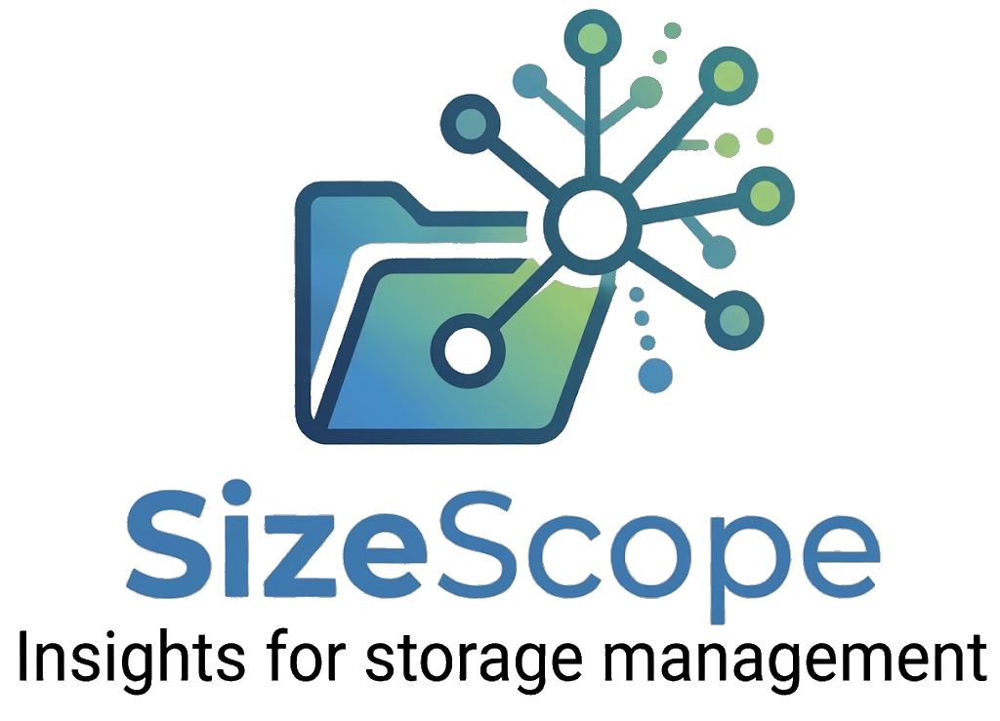

<div align="center">



# SizeScope

**Insights for storage management.**

A self-contained, offline HTML tool for visualising folder and file storage usage from a CSV report — no installation, no server, no data leaves your browser.

[](../../LICENSE)
[](https://github.com/PowerShell/PowerShell)
[](./index.html)
[](https://www.linkedin.com/in/bensonl/)

</div>

---

## 📖 Overview

**SizeScope** is a two-part toolset for understanding where disk space is going on a Windows file share, server volume, or local folder:

1. **`Get-FolderSizeReport.ps1`** — a discovery script you run against the target folder. It recursively inventories every file and folder, calculates cumulative folder sizes, and exports everything to a single CSV.
2. **`index.html` (the SizeScope viewer)** — a single, self-contained HTML file. Open it in any modern browser, load the CSV (drag-and-drop or the "Open CSV" button), and explore an interactive breakdown of your storage — largest folders, largest files, a visual tree, and a pie-chart summary.

The viewer does no network calls of any kind. CSV parsing and rendering all happen locally, in your browser tab — nothing is uploaded anywhere. This makes it safe to use against reports containing internal file paths and folder names.

---

## ✨ Features

- 🔹 **Zero install, zero dependencies** — a single `.html` file. Open it locally, host it internally, or publish it as a static page.
- 🔹 **Built-in discovery script** — click the discovery script button inside the tool to open a modal with the exact, ready-to-edit PowerShell script; no separate download needed.
- 🔹 **Drag-and-drop or file picker** — load a CSV report either way.
- 🔹 **Interactive breakdown** — sortable largest folders/files, a visual size tree, search, extension filtering, and a pie-chart view of space usage.
- 🔹 **Light/dark theme**, remembered per device (via `localStorage` — no report data is ever stored this way, only the theme choice).
- 🔹 **Entirely offline** — safe to run against reports containing sensitive internal paths, since nothing leaves the browser tab.

---

## 📸 Screenshots

*(Add a screenshot of the loaded report view and the discovery-script modal here as the tool is used — see `/images` conventions in the main repository README.)*

---

## 📦 Installation

No installation required.

1. Download `index.html` from this folder (or clone the [Engineer](../../) repository).
2. Open it directly in your browser (double-click, or `File → Open` from your browser menu).

**To make it publicly browsable** (e.g. for your team to bookmark), host `index.html` as a static page — for example via GitHub Pages, an internal IIS/web share, or any static file host. Because it's fully self-contained, no build step or server-side logic is required.

---

## 🚀 Usage

1. **Open SizeScope** (`index.html`) in your browser.
2. Click the **discovery script** button. This opens a modal containing the full `Get-FolderSizeReport.ps1` script, ready to copy.
3. Click **Copy script code**, then paste it into a PowerShell console (or save it as a `.ps1` file — a copy is also included in this folder for convenience).
4. **Update the three placeholder values** near the top of the script before running:
   - `$folderPath` — the folder you want to analyse (the intended source path).
   - `$outputFolder` — where the CSV report should be written.
   - `$outputCsvFile` — the filename for the generated report (e.g. `ServerA-Report.csv`).
5. **Run the script** on the target host. It will scan recursively and write a CSV report to the path you configured.
6. **Transfer the CSV** to the machine where you're viewing SizeScope, if it isn't already local.
7. **Load the report** into SizeScope — either:
   - **Drag and drop** the CSV file anywhere onto the SizeScope window, or
   - Click **Open CSV** and select the file manually.
8. Explore the report: sort by largest folders/files, search by name, filter by extension, or use the pie-chart view for a quick visual summary.

---

## 🧰 Requirements

**For the viewer (`index.html`):**
- Any modern browser (Chrome, Edge, Firefox, Safari). No plugins or installation needed.

**For the discovery script (`Get-FolderSizeReport.ps1`):**
- PowerShell 5.1 (Windows PowerShell) or PowerShell 7+.
- Read access to the target folder/share being scanned.
- Write access to the configured output folder.
- No additional modules required — uses built-in `Get-ChildItem`/`Export-Csv` cmdlets only.

> ⚠️ Recursive scans of very large volumes or network shares can take time and generate meaningful disk/network I/O. Test against a small folder first, and be mindful of running this against production file shares during business hours.

---

## 🗂️ Folder Contents

```
/tools/SizeScope/
├── index.html                    # The SizeScope viewer (open this in a browser)
├── Get-FolderSizeReport.ps1      # Standalone copy of the discovery script
├── CHANGELOG.md                  # Version history for this tool
├── assets/
│   └── SizeScopeLogo_transparent.png
├── sample-data/
│   └── (sample CSV report, for trying SizeScope without running the script first)
└── README.md                     # This file
```

See [`CHANGELOG.md`](./CHANGELOG.md) for this tool's version history — the same list is also viewable in-app via the change log button.

---

## ⚖️ License

Part of the [**Engineer**](../../) repository, licensed under the **Apache License, Version 2.0** — see the root [`LICENSE`](../../LICENSE) and [`NOTICE`](../../NOTICE) files for full terms. Both `index.html` and `Get-FolderSizeReport.ps1` carry their own header comments with authorship and license details, so attribution travels with the files wherever they're copied or shared.

See the root [`DISCLAIMER.md`](../../DISCLAIMER.md) for terms regarding use of the discovery script against production/administrative systems.

---

## 👤 Author

**Benson Lam**
Cloud Technical Lead @ [cubesys Pty Ltd](https://cubesys.com.au)

- 🔗 LinkedIn: [linkedin.com/in/bensonl](https://www.linkedin.com/in/bensonl/)
- 💻 GitHub: [@Benson-Lam](https://github.com/Benson-Lam)
